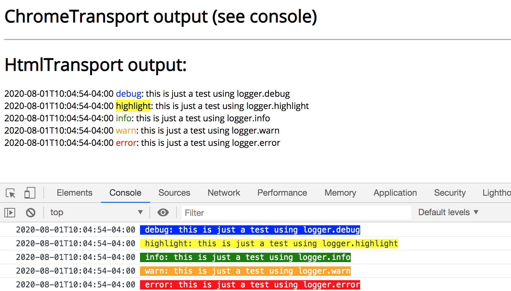
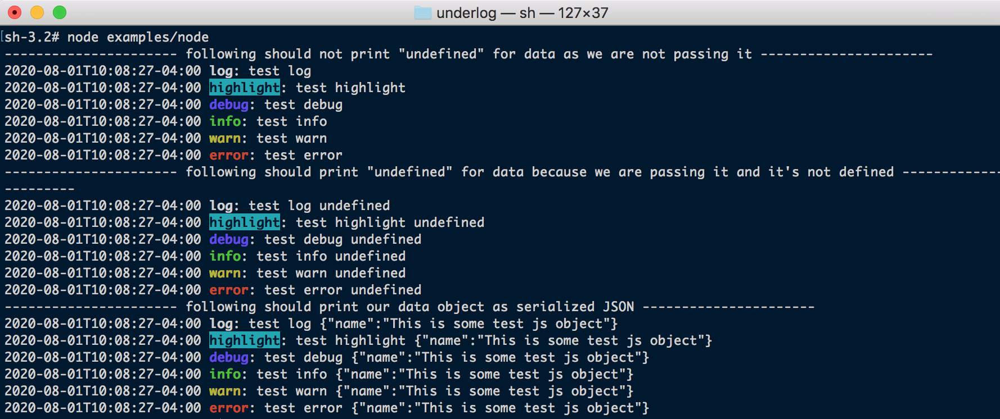

# underlog

Logger that can support different clients (Browser, Node, custom, etc)

# Client Side example with ChromeTransport and HtmlTransport (screenshot)

# Server Side example with StdErrTransport (screenshot)
 

### StdErrTransport Default color styles

{
  log: '0;1;37m', // white, bold
  highlight: '7;1;36m', // cyan background, bold
  debug: '0;1;34m', // blue, bold
  info: '0;1;32m', // green, bold
  warn: '0;1;33m', // yellow, bold
  error: '0;1;31m' // red, bold
}

### Terminal Color Reference (this values can be used for the levelStyles param for the StdErrTransport)
(please note that you can also provide more complex values like `0;1;37m` to define bg, bold or other attributes)

### Terminal Color Reference
###### (this values can be used for the levelStyles param for the StdErrTransport)
>
* Reset: '0m'
* Bright: '1m'
* Dim: '2m'
* Underscore: '4m'
* Reverse: '7m'
>
* Black: '30m'
* Red: '31m'
* Green: '32m'
* Yellow: '33m'
* Blue: '34m'
* Magenta: '35m'
* Cyan: '36m'
* White: '37m'
>
* Bg Black: '40m'
* Bg Red: '41m'
* Bg Green: '42m'
* Bg Yellow: '43m'
* Bg Blue: '44m'
* Bg Magenta: '45m'
* Bg Cyan: '46m'
* Bg White: '47m'
